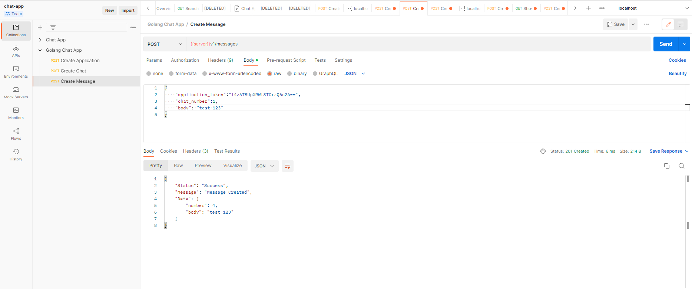

# README

This README would normally document whatever steps are necessary to get the
application up and running.
## Info !
this project built in GoLang 1.19.2 & GIN framework & GORM 
## Installing !

### Install Direct on your Machine

Prerequisites (you must have all these) :
* golang installed & running
* mysql

* must import this database in mysql DBMS ``chat_app_dev.sql`` you will find it in the root folder of this repo

* change your database configurations in ``Config/Database.go`` file 
```
  Host:     "localhost",
  Port:     3306,
  User:     "root",
  Password: "",
  DBName:   "chat_app_dev",
  ```

To start up the application in your local environment:

```bash
git clone https://github.com/EngMohamedFathy/golang-chat-app.git
cd golang-chat-app
go run .
```

Wait some minutes while building. Then,
navigate your API client program as Postman Or other tool

`http://localhost:8080` (8080) default port for gin app

Postman Collection Shared, Click [here](https://documenter.getpostman.com/view/14343417/2s83zgu5Bm) to go to the collection.


Notes :
* database will be created from migration in mysql DBMS: `chat-app-dev` `chat-app-test`


## Running !
use your prefer api client app (for me Postman) and consume all api
Postman Collection Shared, Click [here](https://documenter.getpostman.com/view/14343417/2s83zgu5Bm) to go to the collection.

base URL for API
``http://localhost:8080/api/v1/``



Thanks :)

Enjoy!